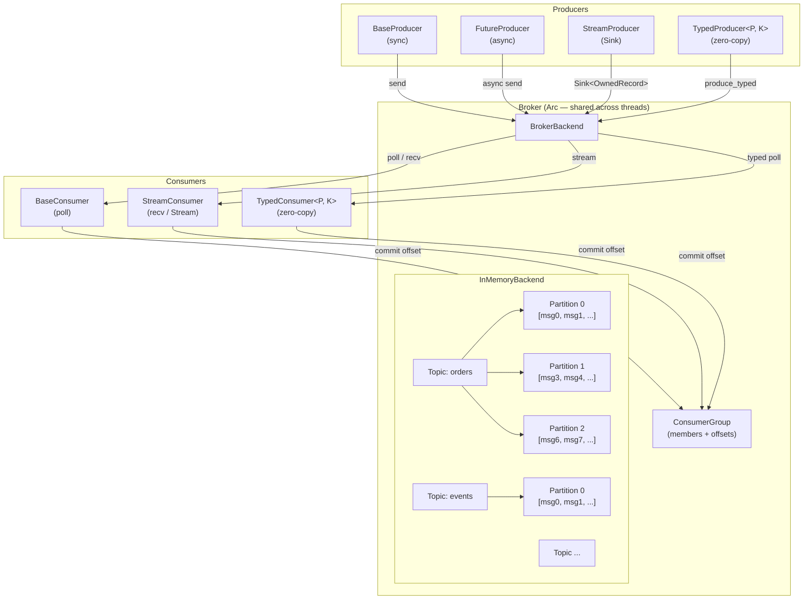
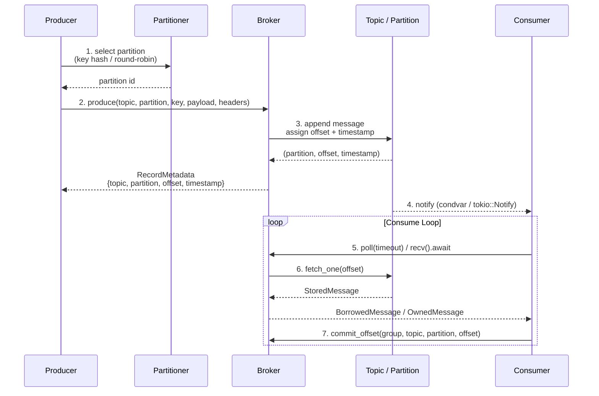
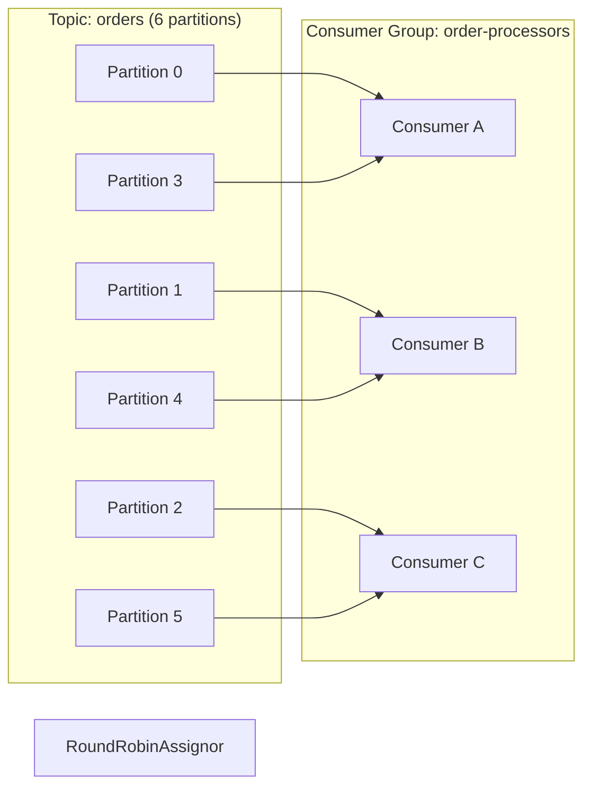
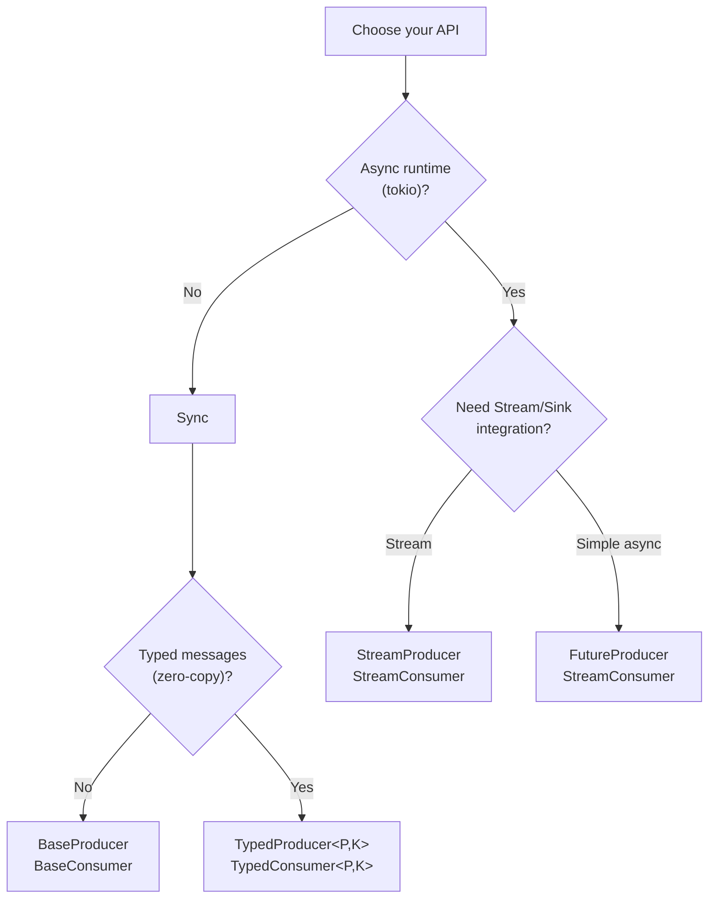
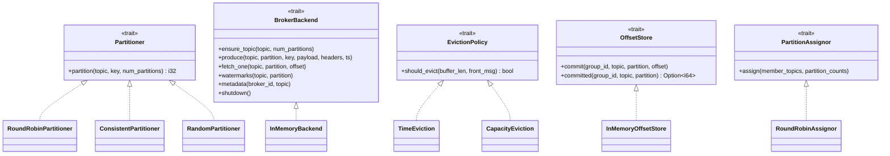

# RMemQueue

A Kafka-like in-memory message queue for inter-thread communication in Rust.

[](https://opensource.org/licenses/MIT)
[](https://www.rust-lang.org)

## Overview

RMemQueue provides a publish-subscribe messaging model inspired by Apache Kafka, supporting topics, partitions, consumer groups, and offset commits. All messages are held in memory, making it ideal for testing, embedded use, or high-performance ephemeral messaging between threads.

**Key features:**

- **In-memory storage** with zero-latency reads and writes
- **Multi-partition topics** with configurable partitioning strategies
- **Consumer groups** with automatic partition assignment
- **Offset management** supporting both manual and automatic commit modes
- **Sync and async APIs** (tokio-based via the `async` feature)
- **Typed message API** that bypasses serialization for direct Rust type handling
- **Stream/Sink adapters** for integration with the Rust futures ecosystem
- **Pluggable architecture** supporting custom backends, partitioners, eviction policies, and offset stores
- **Optional serde JSON support** for easy serialization

## Quick Start

Add to your `Cargo.toml`:

```toml
[dependencies]
rmemqueue = "0.1"
```

### Synchronous API

```rust
use rmemqueue::{Broker, RmqClientConfig, BaseProducer, BaseConsumer, Consumer, TopicPartitionList, Offset};
use std::time::Duration;

// Create configuration
let mut config = RmqClientConfig::new();
config.set("broker.id", "my-broker");
config.set("default.num.partitions", "3");

// Produce messages
let producer = BaseProducer::new(&config).unwrap();
let record = rmemqueue::BaseRecord::to("my-topic")
    .payload(b"hello world")
    .key(b"my-key");
producer.send(record).unwrap();

// Consume messages
let consumer = BaseConsumer::new(&config).unwrap();
let mut tpl = TopicPartitionList::new();
tpl.add_partition("my-topic", 0);
consumer.assign(&tpl).unwrap();
consumer.seek("my-topic", 0, Offset::Beginning).unwrap();

if let Some(Ok(msg)) = consumer.poll(Duration::from_secs(1)) {
    println!("Received: {:?}", msg.payload());
}
```

### Asynchronous API (requires `async` feature)

```rust
use rmemqueue::{RmqClientConfig, FutureProducer, StreamConsumer, Consumer};
use futures_util::StreamExt;

#[tokio::main]
async fn main() {
    // Configure
    let mut config = RmqClientConfig::new();
    config.set("broker.id", "async-broker");

    // Async producer
    let producer = FutureProducer::new(&config).unwrap();
    let record = rmemqueue::FutureRecord::to("async-topic")
        .payload(b"async hello")
        .key(b"async-key");
    producer.send(record).await.unwrap();

    // Async consumer with stream
    let mut consumer_config = RmqClientConfig::new();
    consumer_config.set("broker.id", "async-broker");
    let consumer = StreamConsumer::new(&consumer_config).unwrap();
    consumer.subscribe(&["async-topic"]).unwrap();

    let mut stream = consumer.stream();
    while let Some(Ok(msg)) = stream.next().await {
        println!("Received: {:?}", msg.payload());
    }
}
```

## Usage

### Configuration

All clients share a `RmqClientConfig` object. Required keys and defaults:

| Key | Description | Required | Default |
|-----|-------------|----------|---------|
| `broker.id` | Unique broker identifier | Yes | - |
| `default.num.partitions` | Partitions per topic | No | `1` |
| `partition.buffer.capacity` | Buffer capacity per partition | No | `10000` |
| `retention.policy` | Retention policy: `"none"`, `"time"`, `"capacity"` | No | `"none"` |
| `retention.capacity` | Max messages when policy is `"capacity"` | No | - |
| `retention.ms` | Retention duration in ms when policy is `"time"` | No | - |
| `group.id` | Consumer group identifier | No | - |
| `group.session.timeout.ms` | Consumer group session timeout | No | `30000` |

```rust
use rmemqueue::RmqClientConfig;

let mut config = RmqClientConfig::new();
config.set("broker.id", "my-broker")
      .set("default.num.partitions", "4")
      .set("partition.buffer.capacity", "5000");
```

### Producing Messages

#### BaseProducer (Sync)

```rust
use rmemqueue::{BaseProducer, BaseRecord, Header, OwnedHeaders};
use rmemqueue::Producer; // Trait import for send()

let producer = BaseProducer::new(&config).unwrap();

// Simple message
let record = BaseRecord::to("topic").payload(b"data").key(b"key");
producer.send(record).unwrap();

// With headers
let headers = OwnedHeaders::new()
    .insert(Header { key: "content-type".to_owned(), value: Some(b"application/json".to_vec()) });
let record = BaseRecord::to("topic").payload(b"{\"x\":1}").headers(headers);
producer.send(record).unwrap();

// Specific partition
let record = BaseRecord::to("topic").partition(2).payload(b"data");
producer.send(record).unwrap();

// Query metadata
let metadata = producer.metadata(None).unwrap();
println!("Topics: {:?}", metadata.topics);
```

#### FutureProducer (Async)

```rust
use rmemqueue::{FutureProducer, FutureRecord};

#[tokio::main]
async fn main() {
    let producer = FutureProducer::new(&config).unwrap();
    let record = FutureRecord::to("topic").payload(b"data").key(b"key");
    let meta = producer.send(record).await.unwrap();
    println!("Sent to offset: {}", meta.offset);
}
```

### Consuming Messages

#### BaseConsumer (Sync)

```rust
use rmemqueue::{BaseConsumer, Consumer, TopicPartitionList, Offset};
use std::time::Duration;

let consumer = BaseConsumer::new(&config).unwrap();

// Manual assignment
let mut tpl = TopicPartitionList::new();
tpl.add_partition("topic", 0);
tpl.add_partition("topic", 1);
consumer.assign(&tpl).unwrap();

// Or subscribe to consumer group
consumer.subscribe(&["topic1", "topic2"]).unwrap();

// Seek position
consumer.seek("topic", 0, Offset::Beginning).unwrap();

// Poll loop
loop {
    if let Some(Ok(msg)) = consumer.poll(Duration::from_secs(1)) {
        let payload = String::from_utf8_lossy(msg.payload().unwrap());
        println!("Received: {}", payload);

        // Commit offset (sync or async)
        use rmemqueue::CommitMode;
        consumer.commit_message(&msg, CommitMode::Sync).unwrap();
    }
}
```

#### StreamConsumer (Async)

```rust
use rmemqueue::{StreamConsumer, Consumer};
use futures_util::StreamExt;

#[tokio::main]
async fn main() {
    let consumer = StreamConsumer::new(&config).unwrap();
    consumer.subscribe(&["topic"]).unwrap();

    let mut stream = consumer.stream();
    while let Some(Ok(msg)) = stream.next().await {
        println!("Received: {:?}", msg.payload());
    }
}
```

### Consumer Groups

```rust
use rmemqueue::{BaseConsumer, Consumer};

// Configure with group.id
let mut config = RmqClientConfig::new();
config.set("broker.id", "broker")
      .set("group.id", "my-consumer-group");

let consumer = BaseConsumer::new(&config).unwrap();
consumer.subscribe(&["topic"]).unwrap();

// Partition assignment is automatic
let assignment = consumer.assignment().unwrap();
println!("Assigned partitions: {}", assignment.count());

// Commit offsets (requires group.id)
use rmemqueue::{CommitMode, TopicPartitionList, Offset};
let mut tpl = TopicPartitionList::new();
tpl.add_partition_offset("topic", 0, Offset::Offset(10));
consumer.commit(&tpl, CommitMode::Async).unwrap();

// Query committed offsets
let committed = consumer.committed().unwrap();
```

### Typed Messages (Zero-Copy)

```rust
use rmemqueue::{TypedProducer, TypedConsumer, TopicPartitionList, Offset};
use std::sync::Arc;

#[derive(Clone)]
struct Order {
    id: u64,
    product: String,
}

let producer: TypedProducer<Order> = TypedProducer::new(&config).unwrap();
let consumer: TypedConsumer<Order> = TypedConsumer::new(&config).unwrap();

// Send typed value directly (no serialization)
let order = Arc::new(Order { id: 1, product: "widget".to_string() });
producer.send("orders", order.clone(), None).unwrap();

// Consume as typed value
let mut tpl = TopicPartitionList::new();
tpl.add_partition("orders", 0);
consumer.assign(&tpl).unwrap();
consumer.seek("orders", 0, Offset::Beginning).unwrap();

if let Some(Ok(msg)) = consumer.poll(std::time::Duration::from_secs(1)) {
    let order = msg.payload();
    println!("Order {}: {}", order.id, order.product);
}
```

### Headers

```rust
use rmemqueue::{BaseProducer, BaseRecord, Header, OwnedHeaders};

let headers = OwnedHeaders::new()
    .insert(Header { key: "trace-id".to_owned(), value: Some(b"12345".to_vec()) })
    .insert(Header { key: "content-type".to_owned(), value: Some(b"application/json".to_vec()) });

let record = BaseRecord::to("topic").payload(b"data").headers(headers);
producer.send(record).unwrap();
```

### Custom Partitioner

```rust
use rmemqueue::{BaseProducer, Partitioner};

struct MyPartitioner;

impl Partitioner for MyPartitioner {
    fn partition(&self, _topic: &str, partition_count: i32, _key: Option<&[u8]>) -> i32 {
        // Custom logic here
        0 % partition_count
    }
}

// Note: Custom partitioners can be implemented but must be integrated
// via the broker or producer context (see broker_backend::BrokerBackend)
```

## Feature Flags

| Feature | Default | Description |
|---------|---------|-------------|
| `async` | Yes | Enables async APIs: `FutureProducer`, `StreamConsumer`, `StreamProducer` |
| `serde` | No | Enables JSON serialization: `to_json_bytes`, `from_json_bytes`, `SerdeJson` |

```toml
[dependencies]
rmemqueue = { version = "0.1", features = ["async", "serde"] }
```

## Architecture

### System Overview



**Key concepts:**

| Concept | Description |
|---------|-------------|
| **Broker** | Central component holding topics, partitions, and consumer groups. Shared via `Arc` across all producers and consumers with the same `broker.id`. |
| **Topic** | Named channel for message streams. Auto-created on first produce. |
| **Partition** | Ordered, append-only sequence of messages within a topic. Key to parallelism. |
| **Message** | Contains payload, optional key, headers, timestamp, partition, and offset. |
| **Producer** | Writes messages to topic partitions (sync, async, typed, or stream). |
| **Consumer** | Reads messages from partitions via polling, streaming, or typed API. |
| **Consumer Group** | Named group of consumers that share partition assignment. Enables load balancing. |
| **Offset** | Monotonic position marker for consumption progress. Can be committed and queried. |

### Message Data Flow



### Consumer Group Partition Assignment



When a consumer joins or leaves the group, the assignor redistributes partitions evenly across all members.

### API Selection Guide



### Extensibility Points



## License

MIT
